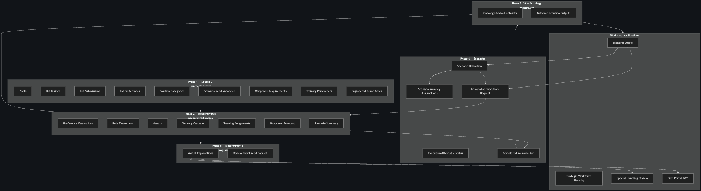
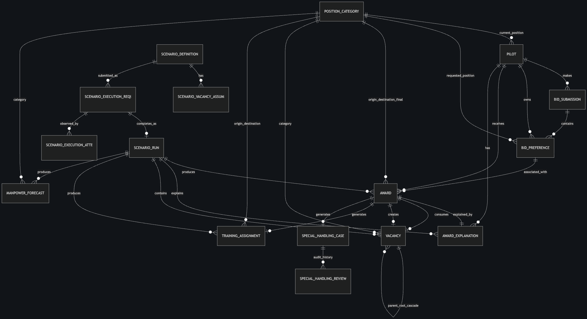

# Strategic Workforce Planning — Technical Architecture

## Executive summary

This portfolio project is a Foundry-based strategic workforce planning application for airline-style pilot vacancy bidding. It combines synthetic source data, a deterministic award and vacancy-cascade engine, an Ontology semantic layer, four Workshop experiences, controlled writeback, and trace-derived award explanations.

The public architecture is intentionally described at the system level. Environment-specific resource identifiers, URLs, branches, groups, run IDs, and implementation keys are omitted.

## System layers

1. **Synthetic inputs** — pilots, bid periods, bid submissions, ranked preferences, position categories, seed vacancies, manpower requirements, training parameters, and engineered demonstration cases.
2. **Deterministic decision engine** — evaluates pilots in seniority order against vacancy availability, bid contingencies, freeze and new-fleet rules, and classification logic. It produces award decisions, preference and rule traces, vacancy lineage, training assignments, manpower forecasts, and scenario summaries.
3. **Ontology preparation** — converts engine and authored-scenario outputs into stable object-shaped datasets.
4. **Foundry Ontology** — models 18 connected business concepts across 40 Link Types.
5. **Workshop applications** — supports scenario authoring, leadership analysis, exception review, and pilot-facing explanation.

## Core Ontology model

The pilot-facing outcome follows `Pilot → Bid Submission → Bid Preference → Award → Award Explanation`. The broader model connects this path to Scenario Run, Vacancy, Position Category, Training Assignment, Manpower Forecast, Scenario Definition, Vacancy Assumption, Execution Request, Execution Attempt, Special Handling Case, and Review Event objects.

## Scenario execution

Scenario authors edit a draft definition and vacancy assumptions through validated Ontology Actions. Submission creates an immutable execution request. The deterministic engine processes that request and emits a completed scenario run with awards, cascades, training demand, manpower forecasts, and summary metrics. This makes authored assumptions distinct from generated outcomes and preserves reproducibility.

## Award, cascade, and explainability

For each eligible pilot, the engine evaluates ranked preferences in a stable order. Each preference is checked against vacancies and governing rules. An award consumes a vacancy and may create a follow-on vacancy, preserving parent and root lineage across the cascade. Preference evaluations and rule evaluations remain available as evidence.

Every Award is linked one-to-one with an Award Explanation. Explanations are generated from persisted preference and rule traces and summarize the selected preference, blocking reasons, contingency evidence, and vacancy lineage. No language model infers or changes the underlying award logic.

## Operational experiences

- **Scenario Studio** — draft definitions, manage vacancy assumptions, create immutable execution requests, and observe status.
- **Strategic Workforce Planning** — review a run, compare scenarios, explore cascades, and analyze training and manpower impacts.
- **Special Handling Review** — progress exception cases through validated workflow states with append-only review history.
- **Pilot Portal MVP** — provide a scoped, read-only view of a pilot's bid, official outcome, explanation, and constrained Q&A.

## Governance and writeback

Generated awards, explanations, vacancies, training assignments, manpower forecasts, and scenario summaries are read-only. Writeback is limited to validated scenario-authoring Actions and special-handling review Actions. Immutable execution requests and append-only review events preserve the audit trail.

## Delivery boundary

### Fully implemented

- Deterministic award, rule-evaluation, and vacancy-cascade processing
- Authored scenario execution and comparison
- Connected Ontology across workforce, bid, scenario, award, training, forecast, and review concepts
- Four role-focused Workshop experiences
- Training, manpower, and trace-derived explanation outputs
- Controlled scenario and review Actions

### Demonstration assumptions

- Synthetic people, demand, vacancy, and bid data
- Demonstration-scale workload and access model
- A single-pilot scoped portal and constrained Q&A
- An internal default-run lookup rather than a production publication process

### Production hardening path

- Enterprise identity binding and pilot-level privacy policies
- Dedicated operational role groups and segregation of duties
- Formal publication and release governance for official awards
- Expanded performance, resilience, observability, retry, and run-control mechanisms
- Production data-quality contracts and operational support procedures

---

*Personal portfolio project. Synthetic data and fictional operating context. No proprietary airline data or rules.*
